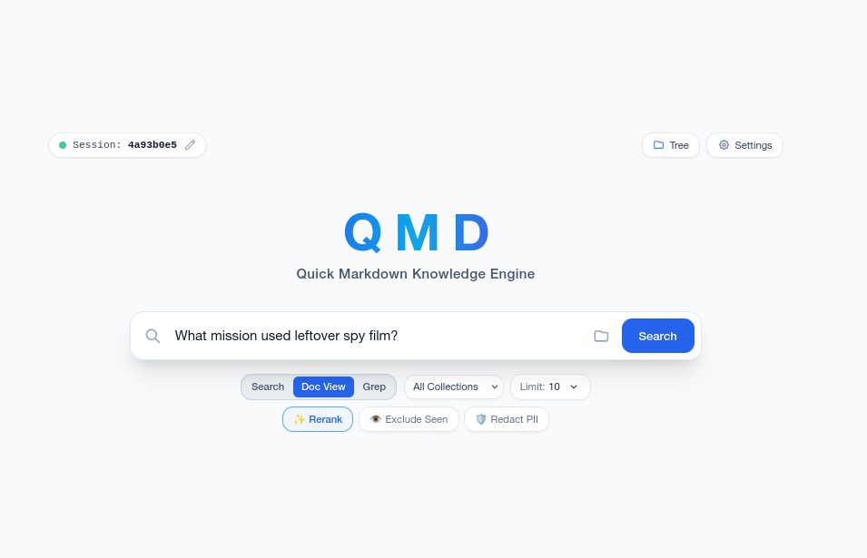
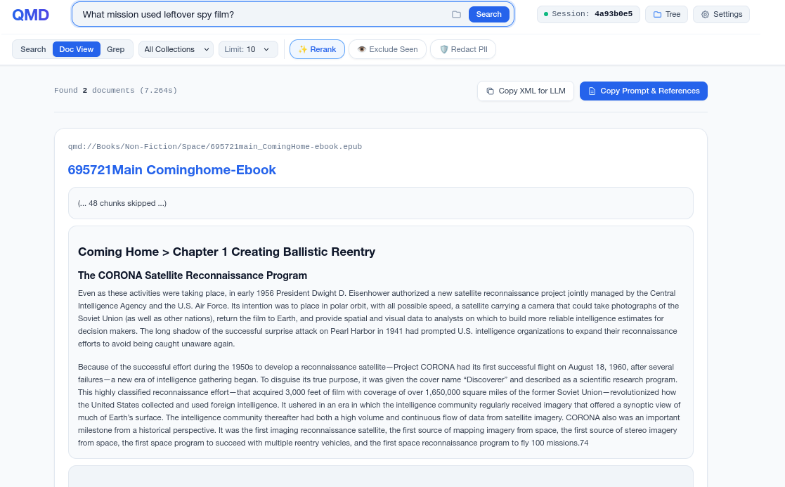
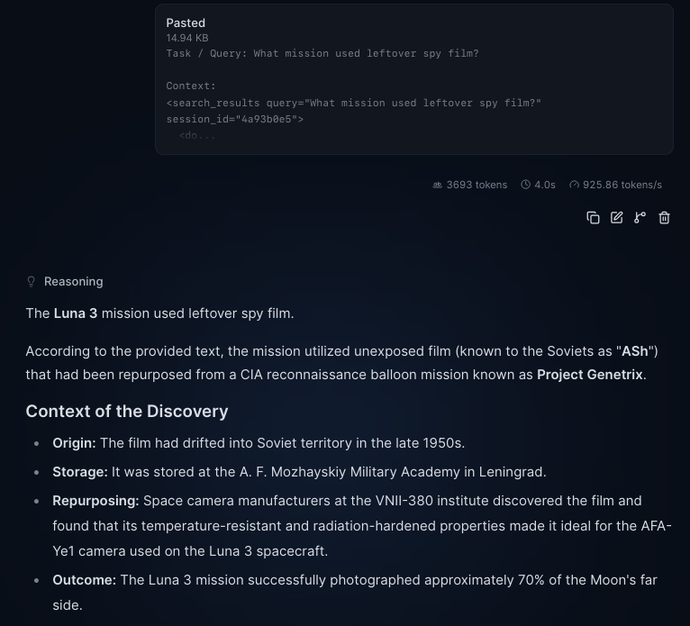

# QMD Python Adaptation - Technical Architecture & Usage Guide

QMD(py) is a quick (markdown-based) local search system, for "Query Multiple Documents".  It's intended to be lightweight, modular, and relatively easy for folks to set up. It was originally inspired by Tobias Lütke's original [qmd](https://github.com/tobi).  On the off chance you're looking for a solution and found this repo, you're almost certainly better off with that project, unless you want super-lightweight python, and a kind of attractive web front end to boot.

This project tries to solve two main problems:

1) **Faking much-more-effective-RAG when you're stuck with an arbitrary LLM web frontend**: QMD has Python CLI interface (`qmd search "how do I get widget A to work with sprocket XYZ?"`) and optional self-serving Flask-based web interface (see pictures below).  By default, it allows you to search across arbitrary "collections" that you can define, which are indexed with full-text search (keyword-based search via SQLite's FTS5 BM25) alongside semantic embeddings, with the reciprocal rank fusion (RRF) hybrid results optionally reranked by a cross-encoder reranker. Queries work best when framed as natural language questions rather than keyword lists.

2) **The above, but exposed as an MCP tool**: So your agent can easily search collections of documents you have.  Results are returned with previous results-aware, nicely chunked and annotated XML snippets.  When you don't want to rely on your agent grepping large file directories of content you DON'T want all of exposed, or with possible **rw** access!

See below for the web-based interface.  You'll see this was clearly a [directed-vibe-coding](https://github.com/theaerotoad/devtool) experience:

**Main web interface, for folks who like GUIs**



**Search results for a given query.  Note the "Copy XML and Prompt for LLM", which lets you easily take your most relevant data—and just it!—to an arbitrary LLM**



**Results of said output, passed into llama.cpp, with a small model's interpretation.**



I highly recommend running your own local embedding (turns chunks of text into meaning-vectors, allows for natural language matching) and reranking (orders which chunks of text best match a result all at once) instance locally.  For QMD, I currently use [EmbeddingGemma](https://huggingface.co/google/embeddinggemma-300m) and [Ettin 150M](https://huggingface.co/jhu-clsp/ettin-encoder-150m).  You can find a super-lightweight OpenAI API compatible driver for both at [good_ettin_here](https://github.com/theaerotoad/good_ettin_here), which works drop-in with this application.

## Limitations

As the name implies, this is mostly about searching documents that are Markdown files.  But it happily ingests a few other common filetypes, such as `docx`, `pdf`, `csv`, `xlsx`, `pptx`, and `epub`.  In these cases, it attempts to store an as-structured-as-possible markdown version of the file, in chunks, to search through.

This means that the system inherently misses images, and sometimes tables (depending on how they're formatted).  An un-OCR-ed PDF file (just full page images without text) will flop.

In the short term, you can go with a solution like the excellent [docling](https://github.com/docling-project/docling) to pre-process and convert your documents into markdown files (including getting image descriptions, etc).

In the long run, I may add to the CLI / MCP side of this application the ability to extract and provide images if the LLM asks for them (which would mean we'd need to include image references along the way).  Or to offer the very (computationally heavy) option of ingesting images or embedded images at index time to include their descriptions.

But for now, know that QMD(py) is a great way to find information that's primarily text based!

## Installation & Quick Start

### 1. Installation
You can install `qmd` as an editable local package. This allows you to modify the source code and have changes take effect immediately.

```bash
# From the project root
pip install -e .

```

**Alternative (No Install):**
You can run the module directly without installing by setting the python path:

```bash
PYTHONPATH=src python3 -m qmd.main [command]

```

### 2. Configuration

Create a configuration file at `~/.config/qmd/index.yml`. You can now define global settings (LLM URL, chunking preferences) alongside your collections.

**Priority Order:** Environment Variables > YAML Config > Defaults.

```yaml
# Global Settings (Optional)
llm_url: "http://localhost:8080" # Default: [http://127.0.0.1:8888](http://127.0.0.1:8888)
strip_links: true                # Simplify [text](url) to just "text"
target_chunk_size: 1024          # Optimal character count per chunk
max_chunk_size: 2048             # Hard limit before forcing a split

# Collections
collections:
  my_notes:
    path: "/home/user/obsidian_vault"
    glob: "**/*.md"
  work:
    path: "/home/user/work_notes"
    glob: "*.md"

```

### 3. Environment Variables

QMD supports optional environment variables to streamline CLI, agent, and server workflows:

```bash
export QMD_LLM_URL="http://localhost:8080"  # Overrides YAML llm_url
export EMBED_MODEL="nomic-embed-text"       # Must match your server's model alias
export RERANK_MODEL="mxbai-rerank-xsmall"   # Optional
export GENERATE_MODEL="llama-3.2-3b"        # Optional

# Configuration & Output Defaults
export QMD_CONFIG="/path/to/custom_config.yml" # Default config file (overrides ~/.config/qmd/index.yml)
export QMD_XML="1"                            # Default all command outputs to XML (for LLM agent contexts)
export QMD_DEEP="1"                           # Default all searches to --deep mode (doc-grouped + reranked)

```

### 4. Usage Commands

**Agent Decision Guide:**

```bash
# Display quick LLM agent decision matrix & workflow
qmd guide
qmd guide --xml

```

**Indexing:**

```bash
# Standard Indexing (Incremental)
qmd update

# Pull git changes before indexing
qmd update --pull

# Force Re-index (Ignore content hashes, re-process everything)
qmd update --force

```

**Searching & Query Formulation:**

> **Query Best Practice:** Frame search queries as clear, natural language questions (e.g. `"how do orbital transfer maneuvers work?"`) rather than keyword lists (`"orbital mechanics transfer"`). Natural language queries maximize semantic embedding recall while SQLite FTS5 extracts lexical stems.

```bash
# Fast Local Search (Hybrid, FTS + Semantic Vector, No LLM)
qmd search "how do I build consistent daily habits?"

# Deep Search: Document Grouping + Cross-Encoder Reranking
qmd search "what are the main software architecture patterns?" --deep

# Broad Search: Hierarchical Wide-to-Narrow Search
qmd search "what were the key discoveries of space exploration?" --broad

# LLM-Agent Context Search (Plain XML with copy-pasteable read attributes)
qmd search "what was the primary mission of helios 1?" --llm

# Multi-Turn Session Search (Deduplicates previously seen chunks across turns)
qmd search "how do consensus protocols handle network partitions?" --session 8f3a1b9c

# Re-include previously seen chunks in session
qmd search "how do consensus protocols handle network partitions?" --session 8f3a1b9c --include-seen

# Filtered Search (By Collection, Title, or Path)
qmd search "how does container bridge networking work?" -c work -t "networking" -p "src/"

# Lexical Override (Force BM25 match if exact identifiers or error codes are needed)
qmd search "why does the system fail with connection refused?" --lex "ERR_CONNECTION_REFUSED"

# Start Web UI (Features interactive File Tree drawer, Grep Mode, Batch runner, & XML export)
qmd serve --port 5000

```

**Targeted Reading & Document Outlines:**

```bash
# Read chunks via shorthand target (coll:path:seq)
qmd read "work:research/deep_space.md:1-5"
qmd read "qmd://work/research/deep_space.md:147"

# Read by chunk row IDs or ranges
qmd read 234-299
qmd read 22,40,25-37 -w 1

# Document Outline & Chunk Sequence Map
qmd outline "work:research/deep_space.md"
qmd outline "research/deep_space.md" -c work --xml

```

**Collection Directory Trees & Listings:**

```bash
# List all configured collections
qmd collections

# Render hierarchical directory tree of indexed files
qmd tree
qmd tree work --depth 2
qmd tree work -p "guide"
qmd tree work --xml

```

**Direct Pattern Matching & Grep:**

```bash
# Exact string matching across raw document bodies with line numbers
qmd grep "import sqlite3" -c work

# Regular expression matching with case sensitivity and path filter
qmd grep "def _[a-z_]+" --regex --case-sensitive -p "src/"

# Export grep matches in JSON or XML for LLM context
qmd grep "TODO:" --limit 20 --json
qmd grep "class \w+Model" --regex --xml

```

**Batch Execution for LLM Agents:**

When prompting an LLM to research questions using QMD, prompt it to emit 1 to 5 commands wrapped in a `<qmd_commands>` XML container using natural language questions. Commands are run sequentially, avoiding unnecessary flags:

```xml
<qmd_commands>
  qmd discover "what are the core principles of orbital mechanics?"
  qmd search "how do orbital transfer maneuvers work?"
  qmd outline "Books:astrodynamics.epub"
  qmd read "Books:astrodynamics.epub:10-15"
</qmd_commands>

```

---

## Motivation & Overview

We are re-implementing **QMD (Now standing for Query Multiple Documents)**, originally a TypeScript/Node.js application, into a lean, modular **Python** CLI tool. The primary motivation is to create a maintainable, high-performance local search engine for personal knowledge bases (Markdown notes) that leverages modern AI capabilities without the heavy weight of local model inference.

By offloading the "heavy lifting" (Embedding generation, Chat completion, and Reranking) to an external, OpenAI-compatible API server (specifically one running `llama.cpp`/`llamaswap`), we can strip away complex native dependencies like `node-llama-cpp`. The result will be a lightweight client that focuses purely on file indexing, SQLite management, and providing a fast, intuitive CLI experience.

## STEP 1: ANALYSIS & STACK SELECTION

### 1. Scope Summary

* **Core Function:** CLI tool to index and search local Markdown files.
* **Smart Chunking:** Implements "Structure-Aware Chunking" (via internal `docparse` module) to respect Markdown headers, tables, and code blocks, ensuring context is preserved in every vector.
* **Search Methods:**
* **FTS:** Full-Text Search using SQLite FTS5 (BM25). Includes built-in stop word filtering to improve baseline relevance.
* **Vector:** Semantic search using cosine similarity on stored binary BLOBs.
* **Hybrid:** Reciprocal Rank Fusion (RRF) combining FTS and Vector results.
* **Rerank:** LLM-based re-ranking of top candidates via a custom `/v1/rerank` endpoint.
* **Grep / Pattern Search:** Fast substring and regex scanning directly over decompressed document contents.


* **Inspection Tools:**
* **Document Outlines:** Extracts heading hierarchies mapped to chunk sequence intervals.
* **Direct Chunk Retrieval:** Context window fetching (`±N` chunks) by `seq_id` or vector `rowid`.
* **Collection Directory Trees:** Visual ASCII and structured XML/JSON hierarchy generation with path pattern filtering.


* **Output Formats:** Human-friendly colored terminal UI, JSON piping, and LLM-optimized XML format with `<chunk>`, `<gap>`, and navigation attributes (`prev_seq`, `next_seq`).
* **Constraints:** Minimal dependencies. No local inference.
* **Configuration:** YAML-based (`~/.config/qmd/index.yml`) with support for stripping links and tuning chunk sizes.

### 2. Tech Stack Proposal

* **Language:** Python 3.10+
* **Database:** `sqlite3` (StdLib).
* **HTTP Client:** `httpx` (async support, minimal footprint).
* **Configuration:** `PyYAML`.
* **CLI Argument Parsing:** `argparse` (StdLib).
* **Progress Bars:** `tqdm` (for indexing feedback).
* **Output Formatting:** Standard ANSI escape codes and XML serializers.

### 3. Clarifications (Resolved)

* **Vector Storage:** Standard SQLite Table (BLOBs) containing packed floats.
* **Reranker:** Using a custom `/v1/rerank` endpoint on the LLM server.
* **Config Format:** Using YAML (requires `PyYAML`).

## STEP 2: ARCHITECTURAL BLUEPRINT

### A. Directory Structure

```
qmd_python/
├── pyproject.toml        # Build System & Dependencies
├── README.md
├── src/
│   └── qmd/
│       ├── __init__.py
│       ├── main.py       # CLI Entry Point & Command Dispatcher
│       ├── config.py     # YAML Config Loader
│       ├── db.py         # SQLite Connection & Schema Migrations
│       ├── store.py      # Business Logic: Indexing, Search, Trees, Grep, RRF
│       ├── llm.py        # API Client (Embed/Chat/Rerank)
│       ├── utils.py      # Hashing, Path Helpers, Range Parsers
│       ├── formatting.py # CLI Output (Colors, Trees, Grep, Snippets, XML, JSON)
│       ├── converters.py # Document Converters
│       ├── epub.py       # EPUB Converter
│       ├── web.py        # Web Server & REST API
│       ├── templates/
│       │   └── index.html # Web Search UI (Drawer Tree, Grep Mode, Doc Viewer)
│       └── docparse/     # Structure-Aware Markdown Parsing
│           ├── parser.py
│           ├── grouper.py
│           └── models.py
└── tests/
    ├── ...

```

### B. Component Specifications

**1. File:** `src/qmd/config.py`

* **Purpose:** Handles loading, validating, and saving the user configuration.
* **Key Dependencies:** `yaml` (PyYAML), `pathlib`, `os`.
* **Core Symbols:**
* `class Config`: Global settings (`llm_url`, `strip_links`, `max_chunk_size`) and collections.
* `def load_config() -> Config`: Reads `~/.config/qmd/index.yml`, applying logic (Env > YAML > Default).


**2. File:** `src/qmd/db.py`

* **Purpose:** Manages the SQLite database connection and schema.
* **Key Dependencies:** `sqlite3`.
* **Core Symbols:**
* `def get_connection(path: Path) -> sqlite3.Connection`: Connects with WAL mode enabled.
* `def init_schema(conn: sqlite3.Connection)`: Idempotent creation of tables.


**3. File:** `src/qmd/docparse/` (Module)

* **Purpose:** Replaces naive text splitting. Parses Markdown into semantic blocks (headers, content) and groups them into optimal chunks using dynamic programming.
* **Core Symbols:**
* `parser.parse_markdown_to_blocks()`: Extracts structure and strips links/images if configured.
* `grouper.group_blocks_into_chunks()`: Assembles chunks while preserving header context.


**4. File:** `src/qmd/llm.py`

* **Purpose:** Abstraction layer for the external AI server.
* **Key Dependencies:** `httpx`, `os`.
* **Core Symbols:**
* `class LLMClient`:
* `embed_batch()`: Batch calls to `/v1/embeddings`.
* `rerank()`: Calls custom `/v1/rerank` endpoint.


**5. File:** `src/qmd/store.py`

* **Purpose:** The central controller. Orchestrates file indexing and search algorithms.
* **Key Dependencies:** `db.py`, `llm.py`, `docparse`, `tqdm`.
* **Core Symbols:**
* `class Store`:
* `index_collection(..., force=False)`: Scans files, calls `docparse`, embeds, and updates DB.
* `prune_orphaned_collections()`: Removes data for collections removed from config.
* `hybrid_search(..., rerank_only=False)`: Runs FTS + Vec + RRF + Rerank. Handles deduplication and scoring.
* `get_chunk_by_id()` / `get_chunk_by_seq()`: Fetches individual chunks, ranges, and surrounding context windows.
* `get_document_outline()`: Generates heading hierarchies correlated to chunk sequence intervals.
* `get_collection_tree()`: Constructs nested directory trees with optional pattern/depth filtering.
* `grep_search()`: Performs line-by-line exact and regex pattern matching across raw documents.


**6. File:** `src/qmd/formatting.py`

* **Purpose:** Formats search results, outlines, chunks, directory trees, and grep matches for terminal and LLM consumption.
* **Key Dependencies:** `sys` (for ANSI codes), `html` (for XML attribute escaping).
* **Core Symbols:**
* `def format_results_cli(results)`: Prints colorized output with snippets.
* `def format_doc_results_cli(grouped_results)`: Prints Document View with merged snippets.
* `def format_results_xml()` / `def format_doc_results_xml()`: Emits structured, boundary-isolated XML for LLMs.
* `def format_chunks_xml()` / `def format_outline_xml()`: Formats chunk extraction and outline data as XML.
* `def format_collection_tree_cli()` / `def format_collection_tree_xml()`: Emits ASCII and structured XML directory trees.
* `def format_grep_cli()` / `def format_grep_xml()`: Emits highlighted terminal lines and XML grep matches.


**7. File:** `src/qmd/main.py`

* **Purpose:** Parses command line arguments and invokes `Store` methods.
* **Key Dependencies:** `argparse`, `store.py`.
* **Core Symbols:**
* `def main()`: Entry point.
* `def handle_search(args)`: Logic for `qmd search` (supports natural language questions, `-v`, `-d`, `-r`, `--xml`, `--json`).
* `def handle_chunk(args)`: Logic for `qmd chunk` / `qmd read` (supports ID/seq lists and ranges).
* `def handle_outline(args)`: Logic for `qmd outline`.
* `def handle_collection_tree(args)`: Logic for `qmd tree` (supports `-p`, `-r`, `--depth`, `--xml`, `--json`).
* `def handle_grep(args)`: Logic for `qmd grep` (supports `-r`, `-s`, `-p`, `--xml`, `--json`).
* `def handle_update(args)`: Logic for `qmd update` (supports `--pull`, `--force`).
* `def handle_guide(args)`: Logic for `qmd guide`.


## STEP 4: PROMPTS & TEMPLATES

The `llm.py` component implements specific formatting rules and prompts extracted from the original `qmd` source.

### 1. Embedding Formats (Nomic/Gemma Style)

When sending text to the `/v1/embeddings` endpoint, you MUST prepend these prefixes:

* **For Queries:** `task: search result | query: {query_text}`
* **For Documents:** `title: {title_or_none} | text: {chunk_text}`

### 2. Query Expansion Prompt

Used in `llm.py` -> `expand_query`. This leverages the Chat API to generate "lex" (keyword), "vec" (semantic), and "hyde" (hypothetical document) variations.

```
You are a search query optimization expert. Your task is to improve retrieval by rewriting queries and generating hypothetical documents.

Original Query: {original_query}

{optional_context_block}

## Step 1: Query Analysis
Identify entities, search intent, and missing context.

## Step 2: Generate Hypothetical Document
Write a focused sentence passage that would answer the query. Include specific terminology and domain vocabulary.

## Step 3: Query Rewrites
Generate 2-3 alternative search queries that resolve ambiguities. Use terminology from the hypothetical document.

## Step 4: Final Retrieval Text
Output exactly 1-3 'lex' lines, 1-3 'vec' lines, and MAX ONE 'hyde' line.

<format>
lex: {single search term}
vec: {single vector query}
hyde: {complete hypothetical document passage from Step 2 on a SINGLE LINE}
</format>

```

## Ideas for making this more useful down the line

* [x] Persistent search sessions (both for CLI, web, and an MCP version)
* [x] Chunk-level seen-state in requests (e.g. --exclude seen)
* [x] Novelty-aware follow-up retrieval (option to not share content that's been shared in earlier related searches)
* [x] Explicit chunk or chunk-fetch by ID
* [x] Return document structure (e.g. markdown headings and sizes)
* [x] XML-tagged output optimized for LLM agent context (`--xml` / `--llm`)
* [x] Return collection tree or subtree (for search narrowing)
* [x] Straight-up keyword level searching or filtering for documents (grep style)
* [x] Make slightly less embarrassing web interface
* [ ] Cursor based paging (not sure yet how to best handle this)
* [ ] Allow (if available) additional document level or directory level summary / classification and metadata that could be used in searching or revealed when sharing results and documents ("File is a review document for XXXX..." "Directory contains PDF assembly drawings..." "Directory is listing of non-fiction books concerning epidemiological issues")
* [ ] Order multi-file listings by original directory order
* [x] Implement a poor-man's clipboard-based RAG/MCP loop--first results copied to LLM include instructions of how to pass back xml-formatted queries--let the user paste those into QMD's web, return to LLM as needed.
* [ ] During indexing, detect if we have duplicate files, especially a .md or .pdf version of the same other file type, and optionally skip indexing
* [ ] Add search-within-sequence-range
